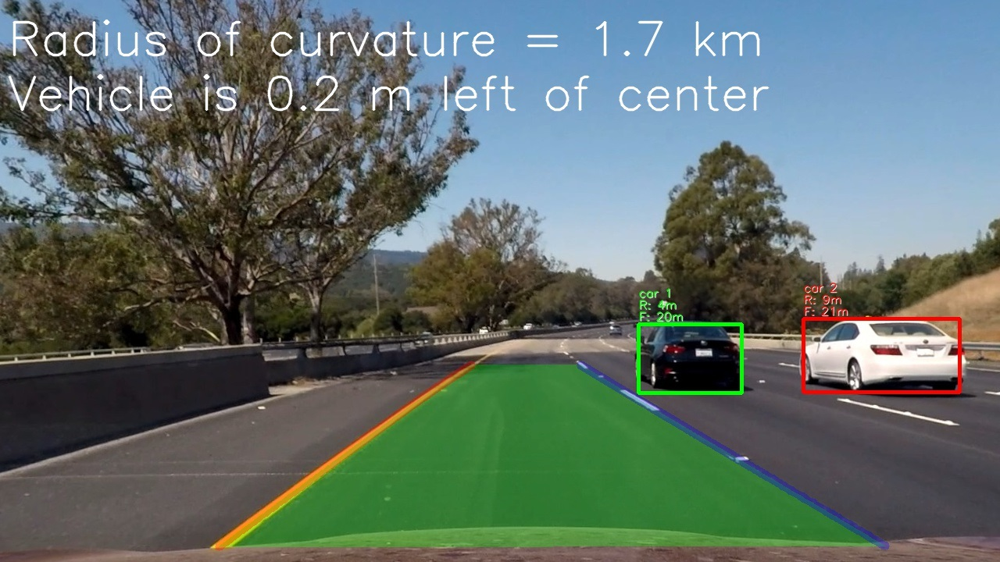

## Advanced Vehicle Detection and Tracking

Detect vehicles in video stream. Identify it position, preliminary distance and track it separately. Additionally detect road lane lines, highlight it and calculate curvature and camera position in respect to lane center.

Vehicle detection algorithm allow use several combinations of classic machine learning methods, classifiers based on CNN (convolutional neural networks) and [YOLO v2](https://pjreddie.com/darknet/yolo) image recognition technology.

---

### Project description as references

This project is extended combination of 2 my separate projects:
* [Vehicle Detection and Tracking](https://github.com/mcounter/VehicleDetection)
* [Advanced Lane Finding](https://github.com/mcounter/AdvancedLaneLines)

The main goals on this combined algorithm:
* Make several experiments with different object detection and tracking methods and understand how it all applicable for self-driving cars.
* Combine lane finding and vehicle detection algorithms in one pipeline to make possible use it together.
* Calculate distance to detected vehicle with help of perspective transformation methods. It makes video more readable and informative. Now it's clear that algorithm not only detect vehicles on plane image, but understand it position on the road.

Project depends on this [Dark Flow (YOLO v2)](https://github.com/thtrieu/darkflow) implementation for Python 3 with TensorFlow 1.0. Please follow documentation if you want install it locally.

Original [YOLO v2 page](https://pjreddie.com/darknet/yolo). You can download different configuration and pre-trained weights from this page.

For more details about YOLO algorithm please reference [this paper](https://arxiv.org/abs/1612.08242).

### Project content
*	[CameraCalibration.py](./CameraCalibration.py) – responsible for camera calibration. Run it to calibrate the camera.
*	[CameraManager.py](./CameraManager.py) – Python class, used to manage camera parameters and perform image transformations.
*	[CreateClassifier.py](./CreateClassifier.py) – Python class, used to create and train classifiers.
*	[DarkflowTest.py](./DarkflowTest.py) – demonstration of Dark Flow application for common image recognition task.
*	[DeepDataEngine.py](./DeepDataEngine.py) – Python base class, read set of images from disk, extract features and prepare dataset for classifier and CNN training.
*	[DeepDataEngineFeatures.py](./DeepDataEngineFeatures.py) – extension of DeepDataEngine class - prepare dataset of features for classifiers.
*	[DeepDataEngineImages.py](./DeepDataEngineImages.py) – extension of DeepDataEngine class - prepare dataset of images for CNN.
*	[FrameProcessor.py](./FrameProcessor.py) – Python class, implements frame processing pipeline.
*	[HOGDemo.py](./HOGDemo.py) – visualize HOG features, used for demonstration purpose only.
*	[ImageClassifier.py](./ImageClassifier.py) – Python class, wrapper for different classifiers from `sklearn` module.
*	[ImageEngine.py](./ImageEngine.py) – Python class, perform all operations with image - color space transformation, features extraction.
*	[LaneLine.py](./LaneLine.py) – Python class, contains information specific for separate lane line.
*	[ProcessImages.py](./LaneLine.py) – run image pipeline.
*	[ProcessVideos.py](./ProcessVideos.py) – run video pipeline.
*	[TrainCNN.py](./TrainCNN.py) – create and train CNN.
*	[README.md](./README.md) – this file.
* [images](./images) - folder with different images used in project writeup.
* [sample_img](./sample_img) - folder with different sample images used by DarkflowTest.py for demo purpose only.
* [camera](./camera) - folder, contains camera parameters (results of calibration) automatically loaded by [CameraManager](./CameraManager.py) class.
* [camera_cal](./camera_cal) - folder with images used for camera calibration.
* [img_data](./img_data) - sample 64x64 images used for classifiers and CNN training. **Note: Due to GitHub limitation, content of this folder was put in 2 separate ZIP archives. Extract files directly in this folder if you plan run pipeline.**
*	[config](./config) - folder with trained classifier Dark Flow configurations. **Note: Due to GitHub limitation, some content of this folder was put in ZIP archive and split on 3 files. Extract files directly in this folder if you plan run pipeline.**
*	[weights](./config) - folder with [YOLOv2 608x608 weights](https://pjreddie.com/media/files/yolo.weights). **Note: Due to GitHub limitation, content of this folder was put in ZIP archive and split on 3 files. Extract files directly in this folder if you plan run pipeline. Or just download it by link.**
*	[test_videos](./test_videos) - folder with test video files: [project_video.mp4](./test_videos/project_video.mp4) - main project video, [challenge_video.mp4](./test_videos/challenge_video.mp4) - challenge video, [test_video.mp4](./test_videos/test_video.mp4) - short test video
*	[test_videos_output](./test_videos_output) - folder with annotated video files: [project_video.mp4](./test_videos_output/project_video.mp4) - main project video, [challenge_video.mp4](./test_videos_output/challenge_video.mp4) - challenge video, [test_video.mp4](./test_videos_output/test_video.mp4) - short test video

### Experiments

During my experiments I tried several algorithms for vehicle detection and compared it:
1. My initial algorithm based on SVM classifiers with linear and RBF kernels. Results of classifiers was mapped to Heat Map and processed with several canny algorithms. This algorithm demonstrates good stable results. But it tends to false positives, which must be suppressed with specially designed filters. And it's slow enough to be used for real-time vehicle tracking. For details please reference my project [Vehicle Detection and Tracking](https://github.com/mcounter/VehicleDetection).
2. The same algorithm, but slow SVM classifier with RBF kernel was replaced by CNN (convolutional neural network) trained on the same image set, but augmented with flipping and affine transformations. The result - less number of false positives and improved pipeline speed. With GPU speed can be increased more significantly. And detected object frames still be not accurate enough, like in initial algorithm version.
3. Algorithm based on results of Dark Flow pipeline for each frame separately. Threshold probability was limited to 40% and labels was limited to: "person", "bicycle", "car", "motorbike", "bus", "truck". Image was previously extended to square size to avoid distortion. On most of frames objects was detected correctly and with accurate frames and can be tracked across most of frames. But on some frames objects can disappear and it cause problems with tracking. Some far-located objects and sub-parts can be detected, which not good for tracking purpose as well. Some false positives are possible as well. So, this algorithm is good enough, but need some more improvements.
4. Combination of Dark Flow pipeline and heat maps. The advantage of this approach, it takes in account not only detected regions, but it level of confidence. It made object tracking more stable with less objects losses and less noise.

### Conclusions
I tested 4 main technics with different parameters and my conclusion:
* Algorithms 2 and 4 showed both good results and have different cons and pros to be used. But finally both are based on CNN and 4th more fast and accurate. It's not stable enough, but I expect this problem can be fixed with training this neural network on special data set focused on vehicles and with different nature conditions. So my choice is 4.

This algorithm was used to created video samples included in project content.
